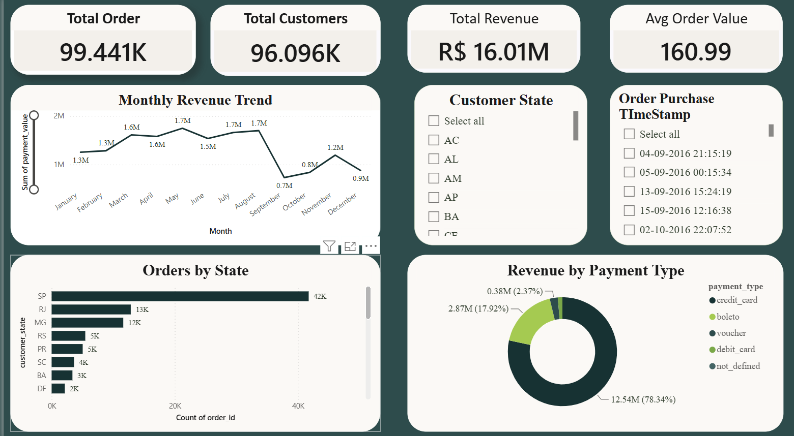

# Olist E-Commerce Sales Dashboard

An interactive **Power BI dashboard** built using the Brazilian Olist e-commerce dataset to analyze sales performance, customer behavior, order trends, product categories, delivery performance, and seller activity.

The project focuses on transforming raw, relational e-commerce data into meaningful business insights through **data cleaning, data modeling, table relationships, DAX measures, and interactive visualization**.

## 📊 Dashboard Preview



---

## 📌 Project Overview

Olist is a Brazilian e-commerce platform that connects customers with sellers.

The dataset contains multiple relational tables representing different aspects of an order, including:

- Orders
- Customers
- Sellers
- Products
- Payments
- Reviews
- Order items
- Product category translations

The objective of this project was to build a business intelligence dashboard capable of answering questions such as:

- How are sales performing over time?
- Which product categories generate the most revenue?
- Which sellers contribute the most to sales?
- How many orders are being delivered successfully?
- How long does delivery take?
- What is the distribution of customer review scores?
- Which payment methods are most commonly used?
- Where are customers and sellers located?

---

## 🗂️ Dataset

The project uses the **Brazilian E-Commerce Public Dataset by Olist**.

The dataset contains approximately 100,000 orders made between 2016 and 2018.

The major tables include:

| Table | Description |
|---|---|
| `olist_orders_dataset` | Order information and timestamps |
| `olist_order_items_dataset` | Products included in each order |
| `olist_order_payments_dataset` | Payment information |
| `olist_order_reviews_dataset` | Customer reviews and ratings |
| `olist_products_dataset` | Product information |
| `olist_customers_dataset` | Customer information |
| `olist_sellers_dataset` | Seller information |
| `product_category_name_translation` | Portuguese-to-English category translation |

---

## 🔗 Data Model

Since the Olist dataset consists of multiple related tables, relationships were established between the tables to create a unified analytical model.

The main relationships include:

```text
Customers
    │
    └── Orders
          │
          ├── Order Items ─── Products
          │                      │
          │                      └── Category Translation
          │
          ├── Payments
          │
          └── Reviews

Sellers
    │
    └── Order Items
```

This relational structure allows information from different tables to be analyzed together.

---

## 🛠️ Tools & Technologies

- **Power BI**
- **Power Query**
- **DAX**
- **Microsoft Excel / CSV**
- **Data Modeling**
- **Data Cleaning**
- **Data Visualization**

---

## ⚙️ Data Preparation

The raw dataset required preprocessing before visualization.

The major steps included:

1. Importing the Olist datasets into Power BI.
2. Inspecting the individual tables and their columns.
3. Cleaning and transforming the data using Power Query.
4. Handling missing and inconsistent values.
5. Converting columns to appropriate data types.
6. Creating relationships between related tables.
7. Creating calculated columns and measures using DAX.
8. Building interactive visualizations and dashboard pages.

---

## 📈 Dashboard Analysis

The dashboard provides insights into several areas of the Olist marketplace.

### Sales Analysis

- Total revenue
- Total orders
- Sales trends over time
- Revenue by product category
- Revenue by seller

### Order Analysis

- Order volume
- Order status distribution
- Orders over time
- Delivery performance

### Customer Analysis

- Customer distribution
- Customer locations
- Review scores
- Customer purchasing behavior

### Product Analysis

- Product categories
- Product sales
- Product performance
- Category-level revenue

### Payment Analysis

- Payment methods
- Payment value
- Number of installments
- Payment distribution

---

## 📊 Key KPIs

The dashboard contains important business metrics such as:

- **Total Orders**
- **Total Revenue**
- **Average Order Value**
- **Average Review Score**
- **Average Delivery Time**
- **Orders by Status**
- **Revenue by Category**
- **Revenue by Payment Method**

---

## 🎯 Project Objectives

The primary objectives of this project were:

- Understand and work with a real-world relational dataset.
- Practice data cleaning and transformation.
- Build relationships between multiple datasets.
- Develop a structured data model in Power BI.
- Create meaningful DAX measures.
- Design an interactive business dashboard.
- Extract actionable insights from e-commerce data.

---

## 📁 Repository Structure

```text
olist-ecommerce-sales-dashboard/
│
├── dashboard/
│   └── Olist_Ecommerce_Dashboard.pbix
│
├── images/
│   └── dashboard_preview1.png
│   └── dashboard_preview2.png
└── README.md
```

> The original dataset is not included in this repository because of its size. It can be downloaded separately from the original dataset source.

---

## 🚀 How to Use

1. Download or clone this repository.
2. Open the `.pbix` file using **Microsoft Power BI Desktop**.
3. If necessary, update the dataset file paths.
4. Refresh the data.
5. Explore the interactive dashboard using the available filters and visualizations.

---

## 💡 Skills Demonstrated

This project demonstrates practical experience with:

- Data Analysis
- Exploratory Data Analysis
- Data Cleaning
- Data Transformation
- Relational Data Modeling
- Power Query
- DAX
- Data Visualization
- Business Intelligence
- Dashboard Design
- Working with Multi-table Datasets

---

## 📚 Dataset Source

The project uses the **Brazilian E-Commerce Public Dataset by Olist**, originally published on Kaggle.

---

## 👨‍💻 Author

**Priyanshu Bhatt**

B.Sc. Computer Science  
Hansraj College, University of Delhi

---

## ⭐ Project

If you find this project useful, consider giving the repository a star.